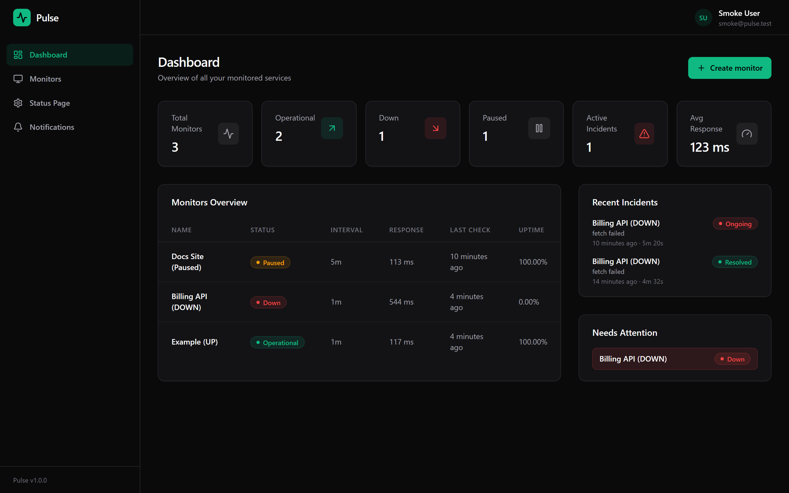

# Pulse

**Fullstack uptime monitoring platform** — HTTP checks on a schedule, anti-flapping incident detection, multi-channel notifications and public status pages, wrapped in a dark, devtools-inspired dashboard.




---

## Table of contents

- [What Pulse does](#what-pulse-does)
- [Tech stack](#tech-stack)
- [Architecture](#architecture)
- [Getting started](#getting-started)
- [Environment variables](#environment-variables)
- [API reference](#api-reference)
- [How monitoring works](#how-monitoring-works)
- [Notifications](#notifications)
- [Security](#security)
- [Testing and CI](#testing-and-ci)
- [Deployment](#deployment)
- [Known limitations](#known-limitations)
- [Future work](#future-work)
- [License](#license)

## What Pulse does

- **Authentication** — register/login with JWT sessions and bcrypt-hashed passwords.
- **Monitors** — HTTP(S) GET/HEAD monitors with configurable interval (30s–10m) and timeout (1s–30s).
- **Scheduled checks** — a BullMQ job scheduler per monitor, executed by a separate worker process.
- **Anti-flapping status** — a monitor only changes state after N consecutive failures (default 3) / M consecutive successes (default 2); the UI explains exactly how many results are pending.
- **Incidents** — automatic OPEN on the first DOWN, automatic RESOLVED on recovery, at most one open incident per monitor (guaranteed by a partial unique index + atomic upsert).
- **Manual checks** — run a check on demand, even while paused.
- **Response time chart** — 24h / 7d / 30d ranges with explicit states for 0, 1 or many checks.
- **Public status pages** — publish `/status/:slug` with global status, 30-day uptime bars and sanitized incident history. No login required to view.
- **Notifications** — Discord, signed generic webhooks (HMAC-SHA256) and SMTP email, delivered by a dedicated worker with finite retries and exponential backoff; per-delivery status (PENDING → SENT/FAILED) is visible in the UI.
- **SSRF protection** — destination validation on create, on edit **and** before every outgoing request (blocklist + DNS resolution, no redirects followed).
- **Ops-ready** — structured JSON logs with redaction, `/health` liveness endpoint, Docker Compose stack, GitHub Actions CI.

More screenshots in [docs/screenshots.md](docs/screenshots.md); design and trade-off notes in [docs/portfolio.md](docs/portfolio.md).

## Tech stack

| Layer | Technology |
| ----- | ---------- |
| Frontend | React 18, TypeScript, Vite, Tailwind CSS, React Router, TanStack Query, React Hook Form + Zod, Recharts, Lucide |
| Backend | Node.js 20+, TypeScript, Express, Zod, JWT, bcrypt |
| Database | MongoDB (Mongoose) with TTL retention and partial unique indexes |
| Queues | Redis + BullMQ — API, monitor worker and notification worker are separate processes |
| Infra | Docker, Docker Compose, Nginx (SPA + reverse proxy), GitHub Actions |

## Architecture

```text
                     ┌──────────────────────────────────────────────┐
                     │  Browser (React SPA served by Nginx)        │
                     └───────────────┬──────────────────────────────┘
                                     │ /api/* (same origin or CORS from env)
                     ┌───────────────▼──────────────────────────────┐
                     │  pulse-api  →  server.cjs  (Express)         │
                     │  auth · CRUD · stats · public status pages   │
                     └──────┬───────────────────────────┬───────────┘
                            │                           │
                    ┌───────▼────────┐          ┌───────▼────────┐
                    │    MongoDB     │          │     Redis      │
                    │ source of truth│          │ BullMQ queues  │
                    └───────┬────────┘          └───────┬────────┘
                            │                           │
                     ┌──────▼───────────────────────────▼───────┐
                     │  pulse-workers → workersRunner.cjs        │
                     │  ├─ worker.cjs           (HTTP checks)    │
                     │  └─ notificationWorker.cjs (deliveries)    │
                     └──────┬───────────────────────────┬────────┘
                            │                           │
                     monitored targets        Discord · Webhook · SMTP
```

Key decisions:

- **Three processes, one codebase.** The API never performs outgoing notification deliveries and workers never serve HTTP; each scales and restarts independently (`workersRunner.cjs` supervises both workers inside a single container/service).
- **MongoDB is the source of truth.** Redis only holds queue state, so eviction (see [Known limitations](#known-limitations)) cannot lose data.
- **Monorepo with npm workspaces.** `packages/shared` holds the Zod schemas and DTO types, so the frontend validates with the *same* rules the API enforces.

## Getting started

### Prerequisites

- Node.js 20+
- Docker (for MongoDB + Redis) — or local instances of both

### 1. Install

```bash
npm install
```

### 2. Configure environment

```bash
cp .env.example .env
# then edit .env — at minimum set a strong JWT_SECRET
```

### 3. Start infrastructure

```bash
npm run infra:up     # MongoDB + Redis via Docker Compose
```

### 4. Run everything (API + monitor worker + notification worker + web)

```bash
npm run dev
```

- Web: http://localhost:5173
- API: http://localhost:4000 (`GET /health` for liveness)

Individual processes: `npm run dev:api`, `npm run dev:worker`, `npm run dev:notify`, `npm run dev:web`.

### Alternative: full stack with Docker

```bash
docker compose up -d --build
```

- Web (Nginx): http://localhost:8080 (proxies `/api` to the API container)
- API: http://localhost:4000

> `docker compose` requires `JWT_SECRET` in your environment/`.env` on purpose — a production stack must never boot with a default secret.

### Quality gate

```bash
npm run lint        # ESLint — 0 errors, 0 warnings
npm run typecheck   # tsc across shared/api/web
npm test            # Vitest — 65 tests
npm run build       # tsup bundles + Vite production build
```

CI runs exactly this sequence on every push and pull request; it never deploys.

## Environment variables

All read from the monorepo-root `.env` (see [.env.example](.env.example), source of truth `apps/api/src/config/env.ts`):

| Variable | Required | Default | Purpose |
| -------- | -------- | ------- | ------- |
| `NODE_ENV` | no | `development` | Enables production hardening when `production` |
| `PORT` | no | `4000` | API port |
| `MONGODB_URI` | no* | `mongodb://localhost:27017/pulse` | Mongo connection (`*` falls back to localhost; set it in any real deployment) |
| `REDIS_URL` | no* | `redis://localhost:6379` | Redis connection for BullMQ |
| `JWT_SECRET` | **yes in production** | dev-only literal | Token signing; startup fails in production with the default |
| `JWT_EXPIRES_IN` | no | `7d` | Token lifetime |
| `CORS_ORIGIN` | no | `http://localhost:5173` | Comma-separated allowed origins (multi-origin supported) |
| `SMTP_HOST/PORT/USER/PASSWORD/FROM/SECURE` | no | — | Email channel; hidden in the UI when unset |
| `NOTIFICATION_MAX_ATTEMPTS` | no | `5` | BullMQ attempts per delivery |
| `NOTIFICATION_BACKOFF_MS` | no | `1000` | Exponential backoff base |
| `NOTIFICATION_WEBHOOK_TIMEOUT_MS` | no | `10000` | Outbound webhook timeout |
| `VITE_API_URL` | no | relative `/api` | Only when the SPA is hosted separately from the API |
| `API_URL` | no | `http://localhost:4000` | Vite dev-server proxy target |

There are no hardcoded domains anywhere — CORS, base URLs and the SPA API base all come from the environment.

## API reference

All routes return JSON. Errors are `{ "message": string }` with a proper status code (400 validation/SSRF, 401 auth, 404 not found, 409 conflict, 500 generic).

| Method | Endpoint | Description |
| ------ | -------- | ----------- |
| POST | `/api/auth/register` | Create account (returns JWT) |
| POST | `/api/auth/login` | Sign in (returns JWT) |
| GET | `/api/auth/me` | Current user |
| GET | `/api/monitors` | List monitors (24h/30d uptime, pause state) |
| GET | `/api/monitors/:id` | Monitor details |
| POST | `/api/monitors` | Create monitor |
| PATCH | `/api/monitors/:id` | Update monitor (reschedules job; URL change resets state) |
| DELETE | `/api/monitors/:id` | Delete monitor + history + incidents + schedule |
| GET | `/api/monitors/:id/checks` | Last 100 checks |
| POST | `/api/monitors/:id/check` | Run a manual check now |
| POST | `/api/monitors/:id/pause` | Pause automatic checks (idempotent) |
| POST | `/api/monitors/:id/resume` | Resume monitoring (idempotent) |
| GET | `/api/monitors/:id/incidents` | Incident history for a monitor |
| GET | `/api/incidents` | All incidents for the user |
| GET | `/api/stats/dashboard` | Aggregated dashboard stats |
| GET | `/api/status-page` | Your status page config |
| PUT | `/api/status-page` | Create/update your status page (slug, monitors, published) |
| GET | `/api/notification-channels` | List channels (targets masked, secrets never returned) |
| POST | `/api/notification-channels` | Create channel (returns HMAC secret once) |
| PATCH | `/api/notification-channels/:id` | Update channel (optional secret rotation) |
| DELETE | `/api/notification-channels/:id` | Delete channel |
| POST | `/api/notification-channels/:id/test` | Send a test notification |
| GET | `/api/notification-deliveries` | Recent delivery attempts + status |
| GET | `/api/notifications/email-status` | Whether SMTP is configured |
| GET | `/api/public/status-pages/:slug` | **Public** — published status page (no auth) |

Authenticated with `Authorization: Bearer <token>` except `/api/auth/*` and `/api/public/*`.

## How monitoring works

1. Creating a monitor registers a **BullMQ Job Scheduler** for the chosen interval — idempotent, rescheduled on updates, removed on delete/pause.
2. The **monitor worker** consumes the queue and calls `runCheckForMonitor`.
3. The service re-validates the destination (SSRF, DNS-resolved), performs the HTTP request with a timeout and **`redirect: 'manual'`**, measures latency, stores a `MonitorCheck` (30-day TTL) and updates the monitor snapshot.
4. **Status semantics** — `< 400` → UP (2xx/3xx healthy; 4xx/5xx means "answered but failing" → DOWN); network errors, DNS failures and timeouts → DOWN.
5. **Anti-flapping** — `evaluateHealth` only transitions after `failureThreshold` consecutive failures or `recoveryThreshold` consecutive successes; everything in between is displayed in the UI as context ("2 / 3 failed checks").
6. **Incidents** — first DOWN opens an incident (`incident_opened` log event); further DOWN checks only refresh the cause; recovery resolves it (`incident_resolved`). A partial unique index (`monitorId + status: OPEN`) plus atomic upsert guarantees at most one open incident even under concurrent workers.
7. **Status pages** — one per user; the public endpoint exposes only safe data (name, slug, description, statuses, uptime buckets, sanitized incidents) — never user IDs, tokens or internal URLs. Global status: all UP → `ALL_OPERATIONAL`, some DOWN → `PARTIAL_OUTAGE`, all DOWN → `MAJOR_OUTAGE` (paused monitors excluded).

## Notifications

- **Channels**: Discord (host-allowlisted `discord.com` webhooks), generic **webhook** (any public HTTPS endpoint, payload signed with **HMAC-SHA256** using a per-channel secret — shown once on creation, rotatable, never returned again) and **email** via SMTP.
- **Flow**: incident event → `notifications` BullMQ queue → notification worker → provider. Deliveries are persisted with status `PENDING → SENT / FAILED` and a dedupe key, so a re-enqueue can never double-send the same `(incident, event, channel)` triple.
- **Retries**: finite (default 5) with exponential backoff; permanent failures (bad URL, 4xx) fail fast without retry; every outcome is logged as `notification_sent` / `notification_failed`.
- **Targets are validated twice**: on create/update (format + blocklist) and again at send time (full DNS-resolved SSRF check).

## Security

- Passwords hashed with bcrypt (12 rounds); JWT auth on every non-public route.
- **SSRF**: localhost, `.local`/`.internal`/`.lan`/`.home.arpa`, private/reserved IPv4+IPv6 ranges (including IPv4-mapped forms), link-local and cloud metadata endpoints are rejected — at create, at edit and **before every outgoing request** (DNS-rebinding defense). Redirects are never followed (all three egress points use `redirect: 'manual'`).
- **No secret leakage**: notification targets are masked in responses, HMAC secrets are returned only on create/rotation, password hashes never leave the API, error messages in production are generic, and the structured logger redacts keys matching `secret|token|password|authorization|apikey|jwt` plus credential-bearing webhook URLs. Delivery errors are URL-stripped before persisting.
- **Headers**: Helmet + CORS restricted to `CORS_ORIGIN` (never `*`), no `x-powered-by`.
- Monitored response bodies are never stored.

## Testing and CI

- **65 Vitest unit tests** across 9 files: incident lifecycle, health evaluation (anti-flapping), SSRF classification, webhook/Discord providers incl. HMAC and redirect handling, SMTP provider, notification delivery state machine, monitor and notification services.
- CI (GitHub Actions): `npm ci` → lint → typecheck → test → build. Any failure fails the build; **there is no automatic deployment step**.

## Deployment

Pulse runs as two services (current production topology on Northflank):

| Service | Command | Role |
| ------- | ------- | ---- |
| `pulse-api` | `node apps/api/dist/server.cjs` | HTTP API |
| `pulse-workers` | `node apps/api/dist/workersRunner.cjs` | Supervises `worker.cjs` + `notificationWorker.cjs` |

Environment for both comes from the platform; the web SPA is a static build with optional `VITE_API_URL`. Any platform exposing the same three commands (Render, Fly.io, a VPS with Docker Compose) works unchanged.

### Redis `volatile-lru` warning

On managed/free Redis (e.g. Upstash) you may see BullMQ log:

```text
Someone else is using the queue... if using Redis Sentinel, use "maxmemory-policy volatile-lru"
```

or a warning about the eviction policy. **This is expected and documented, not suppressed.** Pulse only stores transient queue/cache state in Redis and sets (or inherits) `volatile-lru`, which evicts *expired-keyed* least-recently-used entries under memory pressure. MongoDB remains the source of truth, so eviction cannot lose monitors, checks, incidents or notifications — at worst an enqueued job is delayed. The local Compose file pins `--maxmemory-policy volatile-lru` to match managed providers.

## Known limitations

- Response bodies are not inspected — no keyword or SSL-expiry checks yet (see future work).
- One status page per user.
- No rate limiting on auth endpoints yet (Helmet + generic errors only).
- The main JS bundle is a single chunk (~834 kB / ~241 kB gzip); code-splitting is a candidate for a future pass.
- IPv6 site-local (`fec0::/10`) and NAT64 (`64:ff9b::/96`) ranges are not in the SSRF blocklist (they are non-routable in practice, but noted for completeness).

## Future work

Ideas deliberately **out of scope** for v1.0 — not scheduled:

- Keyword and SSL-certificate expiry checks
- Email/Slack integrations beyond Discord + generic webhook (Slack, Teams, PagerDuty)
- On-call schedules, escalation policies, SMS/paging
- Teams, organizations, RBAC and multi-tenancy
- Billing/plans and self-serve subscriptions
- Custom domains for status pages
- Rate limiting & abuse protection on auth
- Bundle code-splitting pass
- Mobile app

## License

[MIT](LICENSE)
