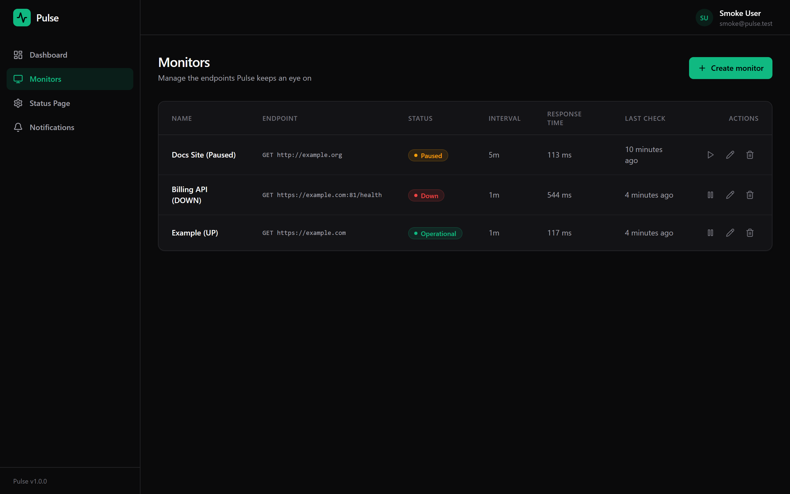
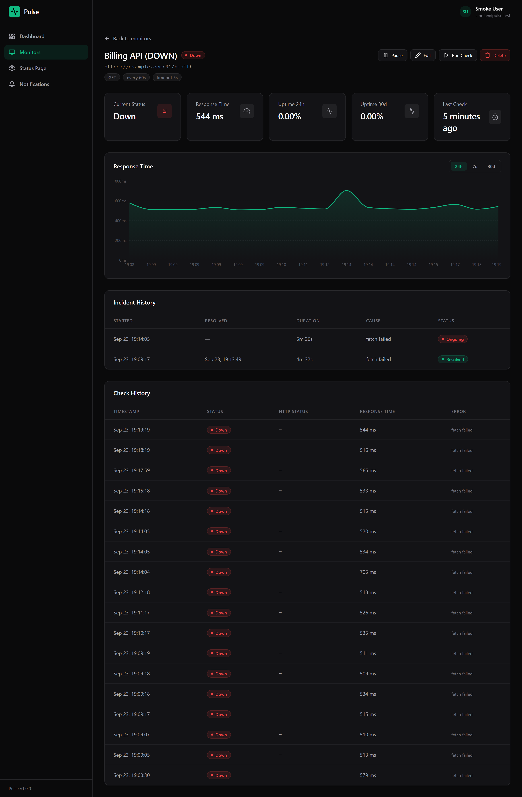
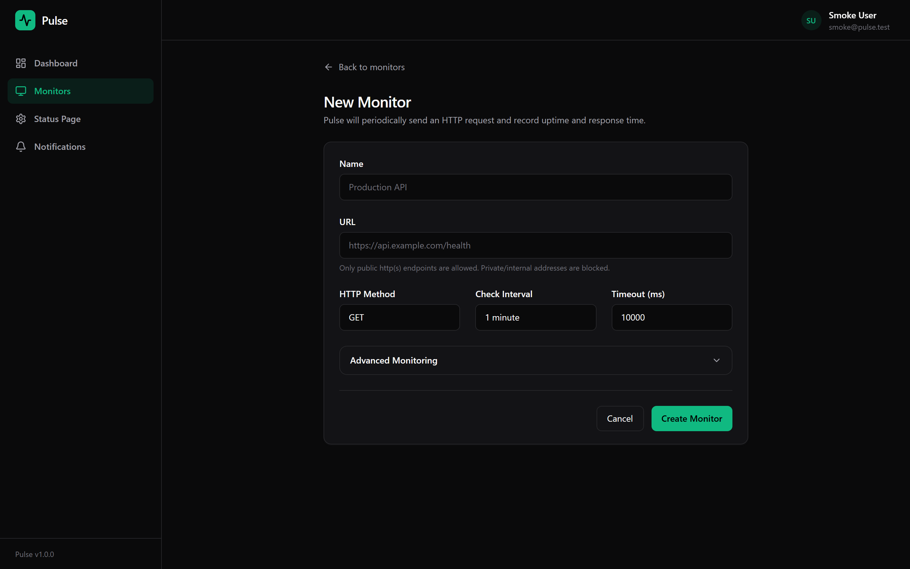
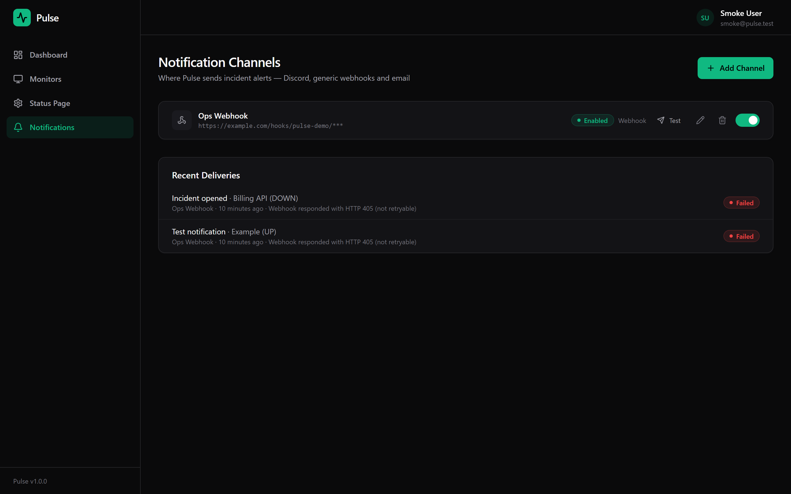
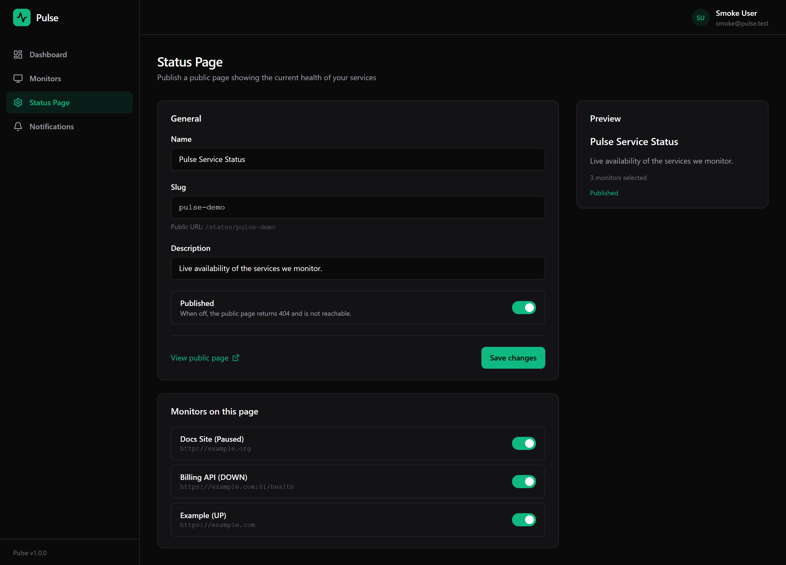
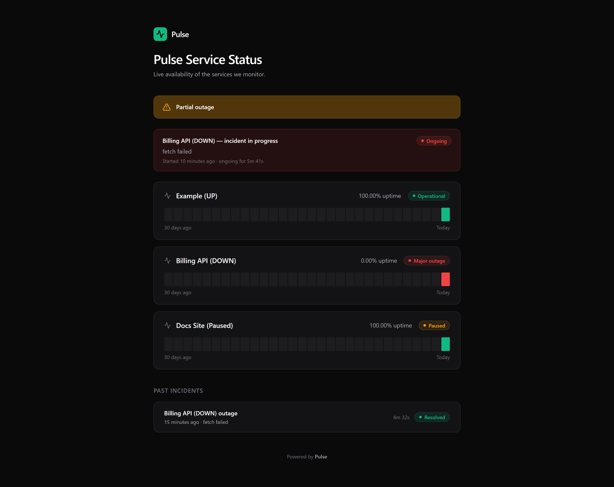

# Screenshots

All screenshots below were captured from the real application (Docker Compose stack,
seeded demo data, Chromium headless) during the v1.0.0 finishing pass. The UI is shown
in its default dark theme.

> The demo data is fictional: a demo user, three example monitors, one webhook
> notification channel and a published status page.

## Dashboard

Overview cards (total monitors, up/down/paused, active incidents, 30-day availability),
status breakdown panel, incident history panel and the monitor list with live status
badges, sparkline charts and uptime bars.

## Monitors

List view with status badges, availability, interval, last check result, paused state,
edit/pause controls and the delete confirmation dialog.

## Monitor detail

Uptime percentage, SSL certificate information, 30-check line chart, pause/delete
actions, recent checks table and the incident history (note the "Still ongoing"
badge on the open incident).

## New monitor

Single-column form with URL, check interval, expected status code, failure threshold,
anti-flap confirmation threshold, pause toggle and active monitor count in the header.

## Notifications

Grid of notification channels with provider icons (Slack/Discord/generic webhook),
masked secrets, enabled state, "Send test" action with the resulting delivery status
(✓ HTTP 405 received, ✗ HTTP 400) and the delivery attempts table with attempt numbers,
HTTP status and error messages.

## Status page settings

Editor with logo upload, custom accent color, company description, sections
(General information / Platform / API), toggle switches and publish state.

## Public status page

Light-theme public page at `/:slug` — no authentication required. Shows overall status
("Partial outage" computed from live incidents), per-service statuses (API degraded,
Webhooks operational, Dashboard operational), uptime percentages and the incident
timeline with resolution events.

